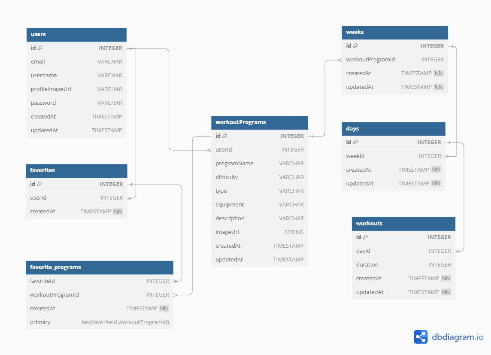

# **Database Schema**

## `User`

| column name     | data type | details               |
| --------------- | --------- | --------------------- |
| id              | integer   | not null, primary key |
| email           | string    | not null, unique      |
| username        | string    | not null, unique      |
| hashedPassword  | string    | not null, unique      |
| profileImageUrl | string    |                       |
| createdAt       | datetime  | not null              |
| updatedAt       | datetime  | not null              |

workout_programs = db.relationship("WorkoutProgram", backref="user", cascade="all, delete")

favorites = db.relationship('Favorite', backref='user', cascade="all, delete")

## `WorkoutProgram`

| column name | data type | details               |
| ----------- | --------- | --------------------- |
| id          | integer   | not null, primary key |
| name        | string    | not null              |
| userId      | integer   | not null, foreign key |
| difficulty  | string    | not null              |
| type        | string    | not null              |
| duration    | integer   | not null              |
| equipment   | string    | not null              |
| description | string    | not null              |
| imageUrl    | string    | not null              |
| createdAt   | datetime  | not null              |
| updatedAt   | datetime  | not null              |

userId references users table.

weeks = db.relationship("Week", backref="workout_program", cascade="all, delete")

days = db.relationship("Day", backref="workout_program", cascade="all, delete")

workouts = db.relationship("Workout", backref="workout_program", cascade="all, delete")

favorites = db.relationship('Favorite', secondary=favorite_programs, backref='favorite_list', cascade='all, delete')

## `Week`

| column name      | data type | details               |
| ---------------- | --------- | --------------------- |
| id               | integer   | not null, primary key |
| workoutProgramId | integer   | not null, foreign key |
| userId           | integer   | not null, foreign key |
| createdAt        | datetime  | not null              |
| updatedAt        | datetime  | not null              |

days = db.relationship("Day", backref="week", cascade="all, delete")

workouts = db.relationship("Workout", backref="week", cascade="all, delete")

## `Day`

| column name      | data type | details               |
| ---------------- | --------- | --------------------- |
| id               | integer   | not null, primary key |
| workoutProgramId | integer   | not null, foreign key |
| weekId           | integer   | not null, foreign key |
| createdAt        | datetime  | not null              |
| updatedAt        | datetime  | not null              |

workouts = db.relationship("Workout", backref="week", cascade="all, delete")

## `Workout`

| column name      | data type | details               |
| ---------------- | --------- | --------------------- |
| id               | integer   | not null, primary key |
| workoutProgramId | integer   | not null, foreign key |
| dayId            | integer   | not null, foreign key |
| createdAt        | datetime  | not null              |
| updatedAt        | datetime  | not null              |

## `Favorite`

| column name | data type | details               |
| ----------- | --------- | --------------------- |
| id          | integer   | not null, primary key |
| userId      | integer   | not null, foreign key |
| createdAt   | datetime  | not null              |

workoutPrograms = db.relationship('WorkoutProgram', secondary=favorite_programs, backref="favorite_list")

## `favorite_programs`

| column name      | data type | details                                 |
| ---------------- | --------- | --------------------------------------- |
| favoriteId       | integer   | not null, foreign key, primary_key=True |
| workoutProgramId | integer   | not null, foreign key, primary_key=True |
| createdAt        | datetime  | not null                                |
